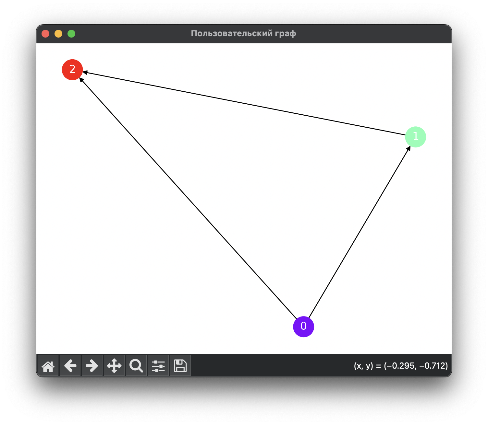

## Домашняя работа по дисциплине `Дискретная математика`.

### Вариант 6. Алгоритмы раскраски графов.

#### Группа:

- Титор Матвей Андреевич

### Запуск программы:

1) Запустить скрипт `main.py` из консоли:

```shell
python3 main.py
```
2) Указать количество вершин в графе
3) Указать ориентированность графа (ориентированный ? да / нет)
4) Указать рёбра графа

### Пример результата для ориентированного графа



### Запуск тестов
1) Основные тесты: 
```shell
python3 test.py
```
2) Тесты скорости:
```shell
python3 test_time.py
```

### Время выполнения алгоритмов раскраски графов

#### Таблица 1: Время выполнения для неориентированных графов

| Количество вершин | Количество рёбер | Время выполнения (секунды) |
|-------------------|------------------|----------------------------|
| 10                | 45               | 0.0005                     |
| 50                | 60               | 0.0021                     |
| 30                | 30               | 0.0010                     |
| 40                | 39               | 0.0018                     |
| 64                | 112              | 0.0035                     |
| 20                | 190              | 0.0028                     |
| 80                | 150              | 0.0042                     |

#### Таблица 2: Время выполнения для ориентированных графов

| Количество вершин | Количество рёбер | Время выполнения (секунды) |
|-------------------|------------------|----------------------------|
| 10                | 45               | 0.0007                     |
| 50                | 60               | 0.0025                     |
| 30                | 30               | 0.0014                     |
| 40                | 39               | 0.0023                     |
| 64                | 112              | 0.0039                     |
| 20                | 190              | 0.0019                     |
| 80                | 150              | 0.0048                     |


